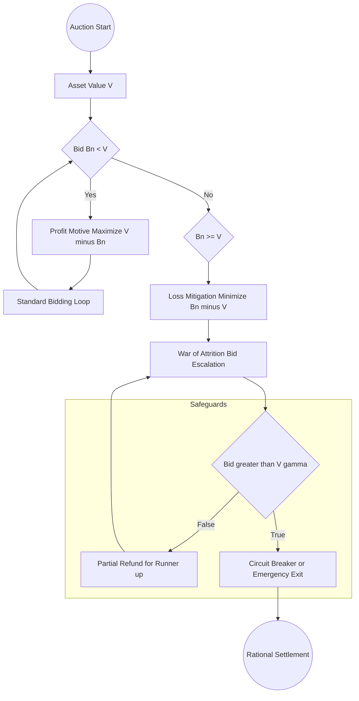

# Architectural Design: Auction Dynamics & The Shubik Paradox

## 1. Executive Summary
This document outlines the game-theoretic foundations of the current auction implementation. By prioritizing structural logic over redundant NatSpec comments, we ensure the codebase remains "lean" while the economic rationale is preserved for auditors and future contributors.

---

## 2. The Dollar Auction Paradox (Martin Shubik, 1971)
The core of this implementation is a defense against the **Dollar Auction**, a sequential non-zero-sum game that demonstrates how rational actors can be driven to irrational escalation.

### 2.1 The Mechanic
In a classic Dollar Auction:
1. An auctioneer auctions a $1.00 bill.
2. The highest bidder wins the dollar.
3. The **second-highest bidder** must also pay their bid but receives nothing.

### 2.2 The Paradoxical Result
As the bid reaches $0.99, the second-highest bidder faces a choice:
* **Fold:** Lose $0.98.
* **Bid $1.00:** Break even (Cost $1.00, Gain $1.00).
* **Bid $1.01:** Lose only $0.01 (Cost $1.01, Gain $1.00).

Mathematically, the player is incentivized to bid **above the intrinsic value** of the asset to minimize a realized loss. In experimental settings, $1.00 bills have famously sold for over $5.00.

---

## 3. Implementation Strategy
To prevent this "War of Attrition" within our smart contracts, we move away from NatSpec-heavy descriptions and focus on functional safeguards.

### 3.1 Sunk-Cost Mitigation
We mitigate the paradox through the following logic gates:
* **Bid-to-Value Caps:** Hard constraints that prevent bids from exceeding a rational multiple of the internal oracle price.
* **Refund Mechanisms:** Partial liquidity returns for the runner-up to break the "all-pay" trap.
* **Time-Decay Weighting:** Reducing the incentive to "grief" the auction in the final blocks.

### 3.2 Logic vs. Documentation
Instead of using `@dev` tags to explain every variable, the code is written to be self-documenting. For example:
* Variables are named by their economic role (e.g., `sunkCostThreshold`).
* State transitions are atomic to prevent race conditions during "bidding wars."

---

## 4. Mathematical Model
The escalation phase is defined by the following relation where $B_n$ is the current bid and $V$ is the asset value:

$$B_n > V \implies \text{Irrationality Threshold}$$

Our contract implements a circuit breaker when the following condition is met:

$$B_n + \Delta \ge V \times \gamma$$

Where:
* $\Delta$ is the minimum bid increment.
* $\gamma$ is the maximum allowable slippage over intrinsic value.

---

## 5. Auditor's Guide
When reviewing the `Auction.sol` file, focus on the following functions:
1.  `placeBid()`: Observe the lack of NatSpec; the logic focuses on the delta between the top two bids.
2.  `settle()`: Note how the "sunk cost" of the runner-up is handled to prevent the Shubik trap.
3.  `emergencyExit()`: A safety valve for when the game state enters an escalation loop.

---

## 6. Conclusion
By acknowledging the psychological traps of auction theory, this implementation provides a robust environment for users. We trade "bureaucratic" code comments for high-level architectural transparency. 

This approach ensures that the "Why" is documented here, while the "How" is executed cleanly in the EVM.

---

## 7. References
* Shubik, M. (1971). "The Dollar Auction Game: A Paradox in Non-cooperative Behavior and Escalation." *Journal of Conflict Resolution*.
* Tversky, A., & Kahneman, D. (1981). "The Framing of Decisions and the Psychology of Choice."
* Project Technical Specification v1.0.4

